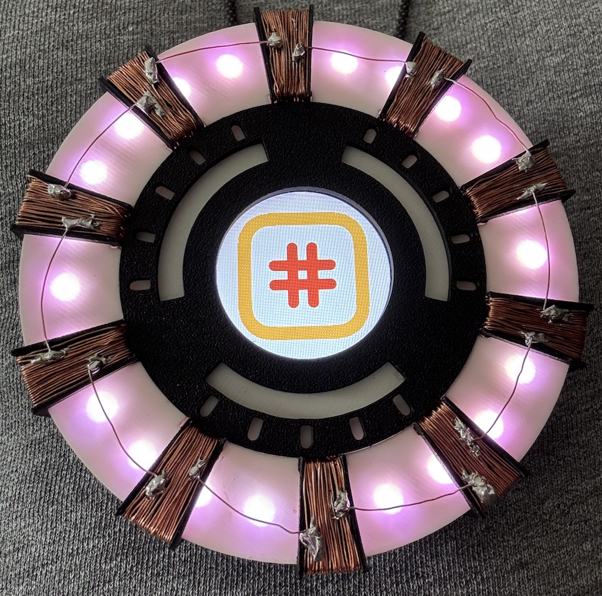

# Arc Reactor

The idea behind this project was to create a cool-looking badge to wear, e.g., at a conference.  
It is modeled after the Iron Man Arc Reactor but includes a small touch screen in the middle for information display.  
The screen scrolls between three logos: the [Pragma Conference](https://pragmaconference.com/about.html) logo (as this project was initially presented there), the [Swift](https://www.swift.org/) logo, and the [Nelcea](https://www.nelcea.be/) logo.  
A long press on the screen displays a QR code with my contact details.  
The Arc also includes an LED ring on its outer edge, with various LED effects.  



## Hardware

The microcontroller used in this project is a [Seeed Studio XIAO nRF52840 Sense](https://wiki.seeedstudio.com/XIAO_BLE/).  
The screen is a [Seeed Studio Round Display for XIAO](https://wiki.seeedstudio.com/get_start_round_display/).  

The ring is a NeoPixel WS2812 24-LED ring. I used [this one from AliExpress](https://www.aliexpress.com/item/1005005808924364.htm), but any WS2812 should work.  
As the touch screen uses the SPI and I2C interfaces, I had to use a GPIO to drive the LEDs. I'm using D0 on the XIAO board for this.  
This pin is normally used to read the status of the battery connected to the display, so this information is unavailable with this setup.  
  
  
A single LED can draw up to 60 mA at full intensity, making the theoretical maximum current draw for the ring 1440 mA.  
This is too much to draw from the XIAO board's 5V pin, so I power the LED ring directly from a LiPo battery with appropriate discharge capacity.  
I'm using a [2500 mAh battery](https://www.kiwi-electronics.com/nl/lithium-polymer-li-po-accu-3-7v-2500mah-1044). This does not provide 5V to the ring, but it still works fine.  
The battery also powers both the display and the XIAO board via the Seeed Studio Round Display battery connector.  

**Disclaimer:** I'm not an electrical engineer. Use any of the hardware setup information provided here at your own risk.

I designed and 3D-printed all the parts to create the Arc Reactor. I'll eventually release all the files, but they still require some clean-up.  

## Software

The implementation is done in Embedded Swift, using the nRF Connect SDK.  

It has been tested with the Swift Development Snapshot from December 10, 2024, nRF Connect SDK 2.8.0, and CMake 3.31.2.  

The file `boards/led_strip_GPIO.overlay` is used to define the devicetree configuration for the LED ring.  

The `LedStripLogic` module includes several types of LED effects. Edit the value of the `ledMode` variable in the `Context` class in `Main.swift` to select the desired effect.

### Building from the Command Line

Ensure you have properly installed the nRF Connect SDK and can build and run one of the simple examples, such as "blinky."  
This project requires nRF Connect SDK 2.8.0 or later.  
Also, ensure you have a recent nightly Swift toolchain installed.  

Specify the nightly toolchain to be used via the `TOOLCHAINS` environment variable, e.g.:
```
export TOOLCHAINS='org.swift.62202412101a'
```
Create the Ninja build file, specifying the target board and the extra overlay to use  :
```
cmake -B build -G Ninja -DBOARD=xiao_ble/nrf52840 -DSHIELD=seeed_xiao_round_display -DDTC_OVERLAY_FILE=./boards/led_strip_GPIO.overlay -DUSE_CCACHE=0 .
```

Build the project:
```
cmake --build build
```

Put the XIAO board in bootloader mode by double-clicking the reset button. This should mount the device at /Volumes/XIAO-SENSE (on a Mac).  

You can then copy the firmware file to it
```
cp build/zephyr/zephyr.uf2 /Volumes/XIAO-SENSE
```

## Known Issues

- `CONFIG_BT` is set in `prj.conf` even though BLE is not (yet) used. Some features require it to function correctly.  
- I was unable to build the project using `west` or the nRF Connect extension in VS Code.  
- Several warnings are emitted during the build process. While they don't impact code execution, it would be good to investigate and resolve them.  

## Coming Soon

- A complete blog post about the creation of this project.  
- A new version supporting Bluetooth connectivity, enabling control from a mobile device.